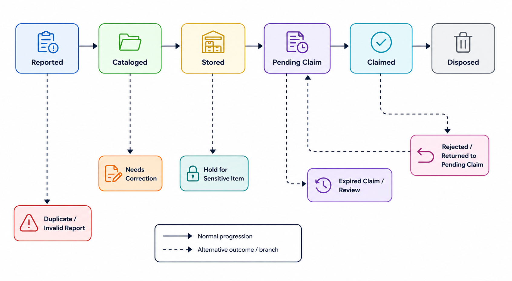

=== *Modeling System Operations*

==== State Model Checking and Inventory Lifecycle
:author: Adriel Bracero Gonzalez

===== Executive Summary
This lecture topic task connects *state model checking* to the Inventory and Item Lifecycle design for the Lost and Found application. State model checking is a formal verification approach used to examine whether a finite-state model satisfies required properties across all possible behaviors. In the context of our project, the inventory lifecycle can be treated as a state machine, where each item moves through states such as reported, cataloged, stored, pending_claim, claimed, and disposed. This document explains how model checking can help us detect invalid transitions, unreachable states, dead ends, and unsafe paths.

===== Scope and Objective
*Scope:* Model checking for the inventory lifecycle state machine, including item intake, custody logging, claim verification, restricted items, retention rules, and disposal.  

*Objective:* Show how the inventory lifecycle can be modeled as a finite state system, analyze it for correctness, and identify practical improvements to the Lost and Found workflow.

===== Why State Model Checking Matters
State model checking is valuable because it can systematically explore all possible state transitions and identify behavior that violates the intended design. A state machine is a natural fit for a lost-and-found workflow because the process is step-based and rule-driven. Items should only move through valid states, and certain actions should be impossible unless specific conditions are met.

For this project, model checking helps answer questions such as:
- Can an item skip cataloging and go directly to claimed?
- Can a disposed item be edited again?
- Is there any state that can never be reached?
- Can a claim be stuck forever in pending_claim?
- Are there unsafe transitions for sensitive items?

===== Source Legend
The following source labels are used in the analysis below:

- *INV* = inventory lifecycle research
- *RISK* = risk assessment research
- *STK* = stakeholder analysis and personas
- *REQ* = requirements traceability
- *SFR* = search / tagging / filtering research

===== Inventory Lifecycle as a State Machine
The inventory lifecycle can be represented as a finite state machine. The basic states are:

- Reported (R)
- Cataloged (C)
- Stored (S)
- Pending Claim (P)
- Claimed (CL)
- Disposed (D)

A simple transition model is shown below.

===== Transition Rules and Guards
A transition rule describes when an item may move from one state to another. A guard is a condition that must be true before a transition is allowed.

[cols="1,2,2",options="header"]
|===
|Transition |Allowed when |Example guard

|Reported -> Cataloged
|Staff has reviewed the report and item metadata is complete.
|Item has title, description, photo, and found-at location.

|Cataloged -> Stored
|Storage label is assigned and custody log entry is created.
|storage_location_id is not empty and actor has staff role.

|Stored -> Pending Claim
|An owner initiates a claim.
|claim token is valid and item is not under legal hold.

|Pending Claim -> Claimed
|Verification succeeds and staff releases the item.
|At least two proof checks are satisfied.

|Stored -> Disposed
|Hold period expires and disposal is approved.
|expected_hold_until has passed and disposal approval exists.

|Any non-terminal -> Hold / Review
|Item is sensitive or suspicious.
|sensitive_flag is true or abuse risk is detected.
|===

===== State-Checking Questions
The model checker should test the following properties:

1. *Safety property:* a disposed item must never be modified again.  
2. *Safety property:* a claim cannot be completed without verification.  
3. *Safety property:* restricted items cannot be released without approval.  
4. *Liveness property:* a valid claim should eventually reach claimed or rejected, rather than remain stuck forever.  
5. *Reachability property:* each intended state should be reachable under at least one valid path.  

These properties are useful because they detect problems that are easy to miss in manual review, especially when multiple roles, rules, and exceptions interact.

===== Possible Modeling Issues to Check
State model checking can reveal a number of issues in the inventory lifecycle:

- *Invalid transition:* a report going directly to claimed without cataloging or staff review.  
- *Unreachable state:* a hold or review state that is defined but never entered by any rule.  
- *Dead end:* a state that cannot progress, such as pending_claim with no verification or rejection path.  
- *Unsafe path:* a sensitive item being released without extra approval.  
- *Repeated mutation bug:* a disposed item still allowing edits or claim attempts.  

===== Results Applied to the Lost and Found System
[cols="1,2",options="header"]
|===
|Finding |Project impact

|Invalid transitions must be blocked
|The backend should enforce state transitions so the UI cannot bypass verification.

|Pending claim needs a timeout or rejection path
|Claims should not remain open forever; they need a staff review or expiry rule.

|Sensitive-item holds need explicit rules
|Security-sensitive items require a separate release path and more logging.

|Disposed must be terminal
|Once an item is disposed, the system should prevent further edits except administrative audit actions.

|Every state needs a clear owner
|The RACI model from the stakeholder lecture becomes more useful when each state has an accountable role.
|===

===== Practical Improvements from Model Checking
If the state model exposes problems, the project can improve in at least two practical ways:

1. *Backend enforcement of allowed transitions*  
   The server can reject illegal status changes so only valid lifecycle paths are possible.

2. *Verification and timeout rules for claims*  
   Pending claims can be forced to either succeed, fail, or expire, preventing indefinite stuck states.

3. *Separate handling for sensitive items*  
   Items flagged as sensitive can move through a restricted branch with staff or security approval.

4. *Auditability for terminal states*  
   Claimed and disposed states can store final logs to support disputes or reviews.

===== References
- Alur, Rajeev, and Mihalis Yannakakis. "Model Checking of Hierarchical State Machines." University of Pennsylvania, https://www.cis.upenn.edu/~alur/Fse98.pdf. Accessed 2026-05-13.
- "Model Checking." Stanford University, https://web.stanford.edu/class/cs357/lecture12.pdf. Accessed 2026-05-13.
- Merz, Stephan. "Model Checking: A Tutorial Overview." University of Illinois at Urbana-Champaign, https://courses.grainger.illinois.edu/cs477/sp2018/resources/papers/model-checking-tutorial.pdf. Accessed 2026-05-13.

