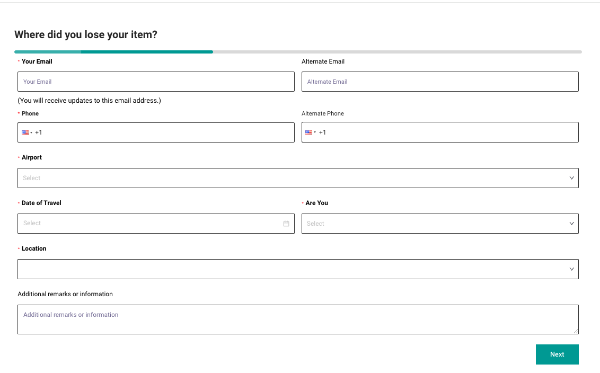
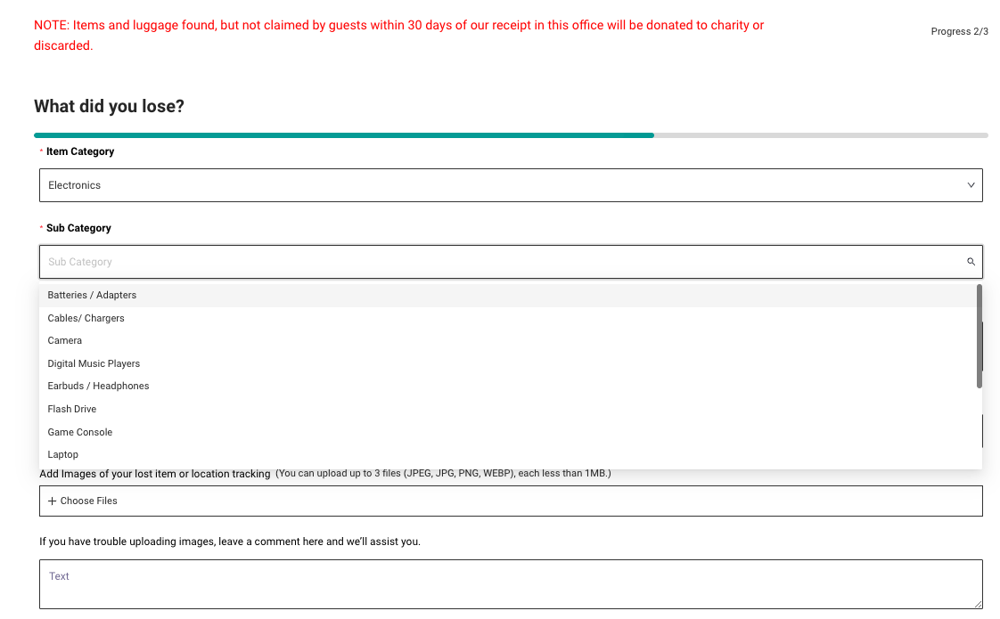
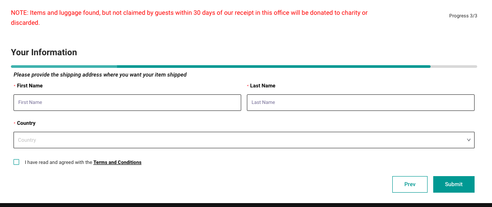
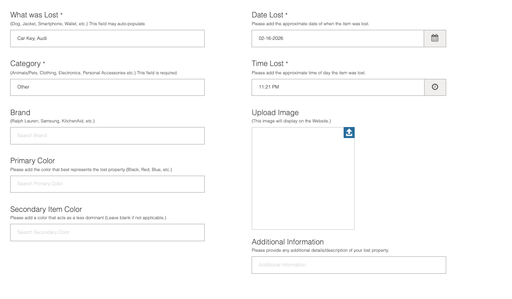
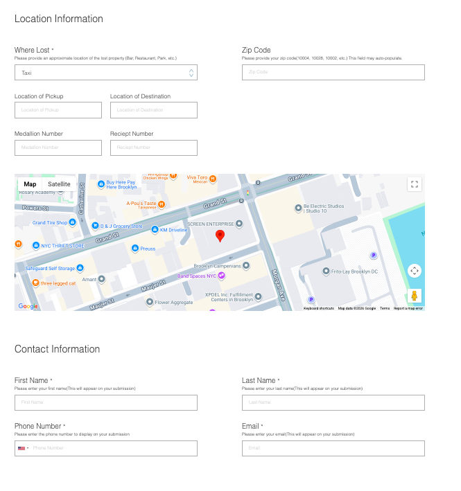
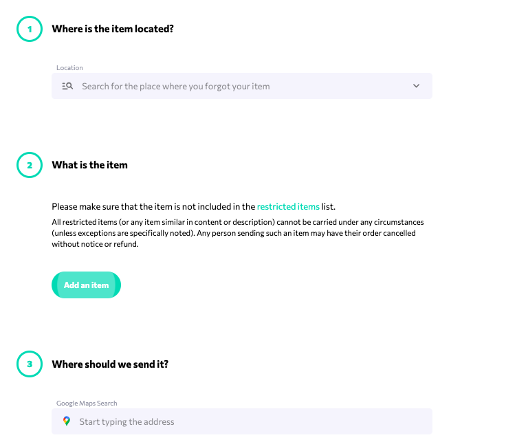
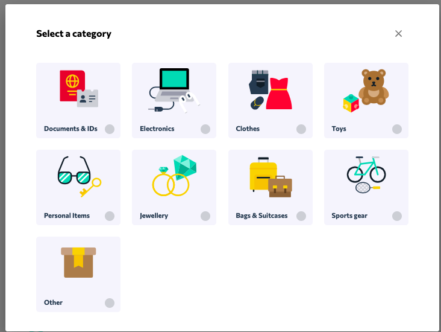
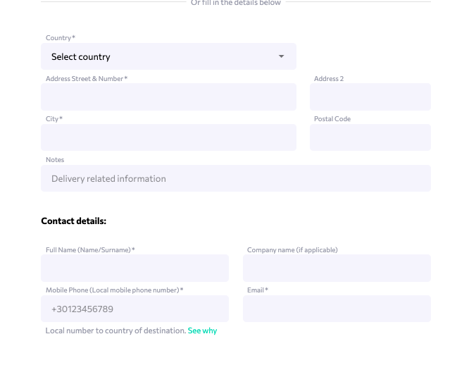

= Lost and Found Information Report Templates #63
=== Description:
This document aims  to research and analyze Lost and Found reporting Templates used by existing platforms such as airports, hotels, etc.With this information, as a team we  are going to be able to identify what fields are mandatory or essential when reporting a Lost or Found item.With the identified fields determine whether our project should use a predetermined report template and which fields should be mandatory, optional, etc.

== Lost and Found Reporting Templates:

=== Aeropuerto Internacional Luis Munoz Marin:
The SJU Lost item report template is divided into three sections. Users must  need to complete all the mandatory information fields in order to proceed  to the next section:
*First Section(Where):*

This section focuses on identifying where the item was lost. The mandatory fields include:

* Email address(alternate email is optional)
* Phone number (alternate phone number is optional)
* Airport (were the item was lost)
* Date of Travel
* User type: “Are you” field / to determine whether the person is: airport employee, arrival passenger, departure passenger or visitor
* If you are a passenger you will be asked to insert your flight number and airline
- Location within the airport (place where you lost yu item on airport e,g Terminal, car rental, babbage claim)

This section ensures that the system collects all the essential contact and location details(where the item was lost) before proceeding. 

*Second Section(What):*

This section focuses on the lost item category. The mandatory fields include:

* Item category
* Sub Category
* Lost Date
* Images
* Comments 
- Brief description

In general this section collects all the important information to identify the lost item.

*Third Section(User information) :*

Last section asks for user information such as:

* Full name 
* Country

Once the three sections have been filled, the user can submit a lost item report, that they can verify status and modify.

=== Lostings 
This platform provides two options to  report one for lost items and the other for found items. The templates are basically the same for both options 

*Lost and Found items Report  template:*

This template has some mandatory fields such as:

* What was lost
* Category 
* Date Lost
* Brand
* Time Lost
* Primary color 
* Secondary Item Color
* Upload Image
* Additional Information
* Where it was lost
* Zip code 
* Pickup Location 
* Contact Information:(email, phone number, full name)

*DeliverBack:*
Since  this platform provides Lost and Found services to multiple types of establishments, users must select first where the r item was lost(Hotel, airport, car rental, hospital, Arb&b,etc)

For this analysis I am using the Hotel report as a reference:

This template asks for:
Lost item information such as:

* Where it was located
* Category
* What was the item
* Where should it be sent
* Contact Details(email, full name, company, phone number,physical and postal address)

== Common Mandatory fields: 

After researching different digital Lost and Found platforms I found the most common and necessary fields, when reporting a lost items, this are:

* Full name of the person reporting
* Contact information  (email and phone number)
* Date the item was lost or found(and time if possible)
* Specific location where the item wa=s last seen
* Item category
* Item description (model, brand, color, type,etc)
Description, photos or supporting images(This section most times is optional)

== Recommendation about Lost and Found report Template:
After researching different Lost and Found platforms, I believe that it is essential to implement a predeterminated template  with mandatory fields. This ensures that we collect all the necessary information before allowing a  user to submit a lost or Found report.

*Some mandatory fields we should implement are:*

* Name of the owner
* Contact fields such as: Phone number, email, etc
* Date: the date the item was lost (if we can be more specific, including  time would be useful)
* Last known Location
* Item category 
* Brief description of the item(Images also)

=== Item Identification approach
There are two possible  ways  to structure “What item  was lost” field: 

1.Allow  users to manually input item description
2. Divide items into categories and require users to select from predefined categories.

I personally think option 2 is more effective. Although we must carefully design comprehensive categories (and recognize that some items may not fit perfectly), we can include an “Other” category where users can manually input their item if it does not appear in the predefined list. 

As seen on some of the reports, we could also divide the items in subcategories.Once a user selects a category the system can dynamically request additional details relevant to the category such as: 

* Brand, 
* Model, 
* Color
* Size
* etc

Also some other important fields(That do not need to be mandatory since for example to everybody has a picture of the item they lost)

* Images
* Brief Description of the lost item

*I also noticed that many of these Lost item report templates tend to separate the information into three sections: Lost item details,  the location and the contact information.*

With all this information in mind, I think that this structured approach could help us to better organize the reported items, have  accountability of items by category and  improve search functionality  for users.

=== Conclusion
By implementing a structured Lost and Found report template with clearly defined mandatory and optional fields will improve data accuracy, organization and user experience. 

=== References

SJU, “¿Extraviaste algún artículo en SJU?”, [Online] Available: https://aeropuertosju .com/lost-and-found-esp/

Lostings, “Online Lost and Found”, [Online] Available: https://www.lostings.com/

DeliverBack, [Online] Available: https://deliverback.com/
