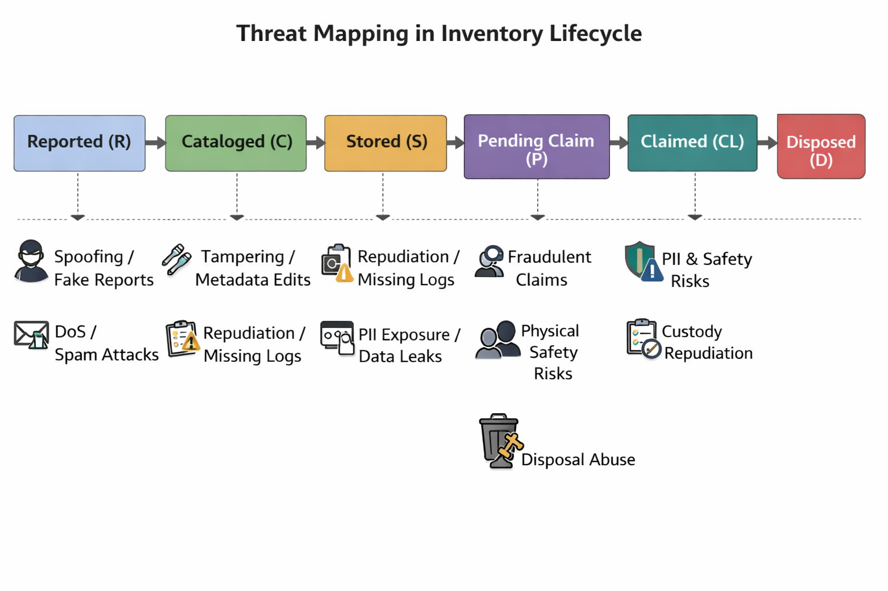

= Risk Assessment and Threat Discovery for Inventory and Item Lifecycle

Adriel Bracero Gonzalez

== Executive Summary
This research brief analyzes risks inherent to the Inventory and Item Lifecycle for the Lost and Found application and provides prioritized mitigations, monitoring guidance, an incident-response checklist for PII (Personally Identifiable Information), and measurable acceptance criteria. The goal is to help the operations teams make informed tradeoffs to reduce privacy exposure, fraud, physical-safety hazards, operational failures, and legal/regulatory liability when recording, storing, claiming, and disposing of found items.

The deliverables in this document include:
- A threat model that maps common and high-impact threats to lifecycle states.
- A risk register and prioritized mitigation recommendations (≥6 mitigations).
- A monitoring plan with detection signals and retention/logging suggestions.
- An incident-response checklist for high-risk scenarios.
- Actionable developer-focused guidance and short prototype pseudocode where useful.

This brief assumes the inventory model defined (item records with custody logs, lifecycle states such as reported → cataloged → stored → pending_claim → claimed → disposed). It complements that design with security, privacy, and operational controls necessary before production rollout.

== Scope and Objectives
*Scope:* Inventory and Item Lifecycle components: API endpoints that create/update items and custody logs, the data model (item records, photos, reporter metadata), staff and user workflows for intake and claims, and offline physical handling processes that the app supports (storage locations, labeling, disposition).

*Objectives:* Identify risks, propose mitigations with complexity and responsible actor, define monitoring signals, and provide incident handling guidance for the most consequential scenarios (fraudulent claims, PII exposure, physical-safety incidents, mass-spam, and improper disposal).

== Threat Model (high-level)
We adopt a pragmatic threat-model mapping similar to STRIDE (Spoofing, Tampering, Repudiation, Information disclosure, Denial of service, Elevation of privilege) focused on lifecycle states and common attack vectors.

=== Lifecycle states (abbrev)
- Reported (R)
- Cataloged (C)
- Stored (S)
- Pending Claim (P)
- Claimed (CL)
- Unclaimed / Disposed (D)

=== Threat mapping overview (general idea of theoretical risks in each state)

== Risk Register (summary)
Below is a concise risk register for the highest-priority items. Each risk includes a short description, likelihood, impact, and quick priority guidance (High/Medium/Low). The brief lists ≥10 notable risks.

[cols="1,2,1,1,2",options="header"]
|===
|Risk ID |Risk description |Likelihood |Impact |Notes / Example

|R1
|Fraudulent claim (social engineering) — attacker claims an item by providing convincing but false proof
|Medium
|High
|Often targets high-value items; may involve forged receipts or photos

|R2
|Exposure of PII — finder or owner contact details exposed through item listing or logs
|Low-Medium
|High
|Could trigger privacy complaints or regulatory actions (GDPR-like concerns in some jurisdictions)

|R3
|Fake / bait reports and spam mass-reporting (DoS) that overwhelms staff
|High
|Medium
|Automated bots or malicious users generate many low-quality reports

|R4
|Chain-of-custody tampering or missing entries enabling repudiation
|Low-Medium
|High
|Operational risk if staff forgets to log custody changes or attackers delete logs

|R5
|Improper disposition / unauthorized disposal of sensitive items
|Low
|High
|Donations, destruction, or sale without required hold period or approvals

|R6
|Physical-safety incidents during pickups (meetups, theft, assault)
|Low
|High
|Risk to users collecting items directly from finders or unknown locations

|R7
|Image-based privacy leakage (photos revealing address, names, IDs)
|Medium
|Medium
|Owner photos may accidentally include sensitive text or identifiers

|R8
|Unauthorized access to storage location manifests (employees abusing access)
|Low
|Medium
|Insider threat: staff or volunteers accessing items without process

|R9
|API abuse / scraping that builds profiles of finder behavior
|Medium
|Medium
|Large-scale scraping of public items to deanonymize finders or owners

|R10
|Third-party dependencies (e.g., storage or search services) misconfiguration leaking files
|Low-Medium
|High
|S3 bucket misconfig or badly configured CDN can expose photos
|===

== Mitigation Recommendations (≥6)
For each mitigation there is: description, estimated complexity (Low/Med/High), and responsible actor(s). Prioritize by impact/feasibility during sprint planning.

[cols="1,1,1,1",options="header"]
|===
|Mitigation |Short description |Complexity |Responsible actor(s)

|M1 — Mediated Claim Verification (two-stage)
|Implement a mediated claim flow: owner initiates claim in-app (photo proof + unique details). The system creates a secure, time-limited claim token and notifies staff to verify at pickup. Staff must confirm identity via at least two independent signals before marking 'claimed'.
|Med
|Frontend, Backend, Operations/Staff

|M2 — Minimal public PII + Tokenized Communications
|Do not publish finder contact details. Use ephemeral tokens (6-digit codes) routed via the platform (email/SMS) to mediate contact; store only hashed contact tokens for verification.
|Low
|Backend, Frontend

|M3 — Chain-of-Custody Enforcement and Immutable Logs
|Require custody-log append-only records (write-once semantics), capture actor_id, timestamp, and an optional signature (staff initials or digital signature). Consider storing logs in tamper-evident storage and keep a periodic signed digest.
|High
|Backend, Operations

|M4 — Rate-limiting, CAPTCHA, and Anomaly Detection for Reports
|Protect report endpoints with per-IP and per-account rate limits, captcha for suspicious flows, and simple anomaly signals (sudden surge of reports from same IP / geo).
|Low
|Backend, Frontend

|M5 — Photo and Metadata Sanitization
|Automatically scan uploaded photos for sensitive content (text regions, IDs) and flag for manual review; blur or mask detected text on preview with opt-in reveal for staff.
|Med
|Backend (image pipeline), Operations

|M6 — Secure Storage Defaults and Least Privilege
|Store images and files in private object storage (S3/compatible) with presigned URLs for access. Enforce least-privilege IAM roles and rotate credentials; require MFA for staff access to critical operations.
|Low-Med
|Backend, DevOps

|M7 — Pickup Safety Guidance and In-App Safe-Meet Features
|Provide safety messaging, recommend public pickup locations (campus police desk), and offer "staff-mediated pickup" option where staff hands over item. Optionally schedule staffed pickup slots via the app.
|Low
|Frontend, Operations

|M8 — Disposal Controls and Approval Workflow
|Prevent automated disposal: require staff approval and an approval checklist to mark 'disposed'. Log approvals and keep a 1-year record of disposal decisions.
|Med
|Backend, Operations

|===

== Monitoring Plan and Detection Signals
Design monitoring to detect early indicators of fraud, abuse, and operational issues. For each signal we include suggested retention and logging policy.

[cols="1,1,1",options="header"]
|===
|Signal |Why it matters |Suggested retention / logging policy

|S1 — Spike in report creation from single IP or device fingerprint
|Can indicate bot-driven spam or targeted attackers trying to flood intake
|Log full request metadata for 30 days; store aggregated metrics for 365 days. Alert if > X reports in Y minutes.

|S2 — Multiple claim attempts for the same item from different accounts / IPs
|Indicates potential coordinated fraudulent claims
|Keep detailed claim attempt logs for 180 days; escalate to manual review after threshold

|S3 — Repeated edits to item metadata or photos within short windows
|Possible tampering or an attacker trying to change identifying features
|Log edit diffs for 365 days; retain previous photo versions (or thumbnails) for 90 days

|S4 — High ratio of items flagged by users as suspicious
|Community signals often detect scams or low-quality reports
|Store flags and reporter ids for 365 days; trigger review if ratio exceeds threshold

|S5 — Unusual access patterns to object storage (many presigned URL requests)
|May indicate scraping or exposed URLs
|Store S3 access logs indefinitely (or per provider limit); rotate presigned tokens and record their issuance for 180 days

|S6 — Frequent claim token validation failures from same IP/account
|Attackers trying to guess tokens or conduct brute-force claims
|Log attempts with IP and device fingerprint for 90 days. Throttle after few failures and temporarily ban

|S7 — Staff role anomalies (same staff account performing many custody transfers rapidly)
|Potential insider abuse or compromised staff account
|Log staff actions with long retention (1–3 years) and require periodic audits

|S8 — Submission of images with detected textual content resembling IDs or addresses
|Photos containing PII increase privacy risk and may require special handling
|Store flagged images in secure storage, mark sensitive=true, retain for 365 days (or per policy); restrict access to ops team only

|S9 — Geolocation anomalies (claims from far-away locations for nearby-found items)
|May indicate fraudulent remote claim attempts
|Keep geolocation checks for 180 days; include in composite score for manual review

|S10 — Sudden surge in disposal actions or disposal without approvals
|Indicates process abuse or automation errors
|Retain disposal logs and approval records for 3 years
|===

*Logging and retention guidance (short)*
- Use structured logs (JSON) with consistent fields: event_type, actor_id, item_id, timestamp, ip, device_fingerprint, geo, details.  
- Keep high-fidelity logs for at least 90 days for incident investigations; keep summarized metrics and digests for 1+ years. Longer retention (1–3 years) for custody, disposal, and staff action logs.  
- Ensure logs are tamper-evident (signed digests or append-only storage) and accessible to authorized auditors only.

== Incident Response Checklist (High-risk incidents)
This checklist is a practical runbook for the top incidents: fraudulent claim takeover, PII exposure, physical-safety report, and mass spam attack.

=== Immediate actions (first 60 minutes)
1. **Contain**: Temporary freeze item(s) affected (set status to "quarantine" or "investigation") and disable claim endpoints for those items. Revoke any active presigned URLs tied to items.  
2. **Preserve evidence**: Snapshot relevant item records, custody logs, and request logs. Preserve images and store a signed digest.  
3. **Notify**: Inform the on-call ops/security lead and an assigned manager. If physical safety is involved, notify campus/public safety immediately.  
4. **Communicate**: Draft an internal incident note; do not publish public statements until facts are verified. Send a limited notice to affected user(s) if PII exposure is likely (follow legal guidance).

=== Short-term actions (same day)
1. **Triage**: Classify incident severity (low/medium/high). Assign owners and timeline for next steps.  
2. **Mitigate**: Apply immediate mitigations: block suspect accounts/IPs, reset staff credentials if compromised, require additional verification on related claims.  
3. **Investigate**: Pull logs, review custody chain, interview staff involved, and reconstruct timeline. Use detection signals to find related incidents.

=== Recovery and post-incident (days 1-14)
1. **Restore**: Reinstate safe services, fix configuration vulnerabilities, and close any exploited loopholes.  
2. **Remediate**: Implement planned mitigations (e.g., stricter verification, throttling, policy updates).  
3. **Notify and report**: Notify affected individuals per policy and legal requirements. Produce an incident report with root cause, timeline, impact, and remediation.  
4. **Lessons learned**: Run a retrospective, update runbooks, and adjust monitoring thresholds.

== Prototype snippets (pseudocode)
[source,python]
----
# Claim token flow (simplified)
import secrets, time

def create_claim_token(item_id, owner_contact):
    token = secrets.token_urlsafe(8)
    expiry = int(time.time()) + 15*60  # 15 minutes
    store_token_hash(item_id, hash_token(token), expiry)
    send_token_to_owner(owner_contact, token)
    return True

def validate_claim_token(item_id, token):
    rec = lookup_token_hash(item_id)
    if rec and rec['expiry'] > int(time.time()):
        if check_hash_match(rec['hash'], token):
            mark_pending_claim(item_id, rec['requester_id'])
            return True
    return False
----

[source,python]
----
# Simple suspicious-behavior detector (moving window)
from collections import deque, defaultdict
import time

recent_reports = defaultdict(lambda: deque(maxlen=100))  # ip -> timestamps

def record_report(ip):
    now = time.time()
    recent_reports[ip].append(now)
    # if > 20 reports in 5 minutes, flag
    window = [t for t in recent_reports[ip] if now - t < 300]
    if len(window) > 20:
        alert_ops(ip, len(window))
----

== Additional Recommendations and Operational Notes
- *Privacy by design*: Default to the least amount of PII in public records. Use tokens and mediator flows instead of exposing finder details.  
- *Staff training*: Operations staff must be trained in chain-of-custody and verification checklist; this is an operational control as important as technical enforcement.  
- *Legal review*: Run the retention and disposition policy by the institutional legal counsel for compliance with local law (especially for IDs, passports, or weapons).

== References
- Stone, Rich, and NIST. "Risk Management Framework." *NIST Special Publication 800-37 Revision 2*, National Institute of Standards and Technology, 2018, https://nvlpubs.nist.gov/nistpubs/SpecialPublications/NIST.SP.800-37r2.pdf.
- Shostack, Adam. *Threat Modeling: Designing for Security*. Wiley, 2014, https://media.wiley.com/product_data/excerpt/98/11188099/1118809998-38.pdf
- OWASP Foundation. "Threat Modeling." OWASP, https://owasp.org/www-project-threat-dragon/.
- Amazon Web Services. "Logging and Monitoring Best Practices." AWS Whitepapers, https://aws.amazon.com/training/?trk=8699e5f8-13e0-4d74-bb6c-cb2790cc0693&sc_channel=ps&s_kwcid=AL!4422!10!71605979533683!!!!71606540668680!!487441815!1145692963993272&ef_id=6ca5d4f3a4471a66d422bd6e69ece894:G:s

