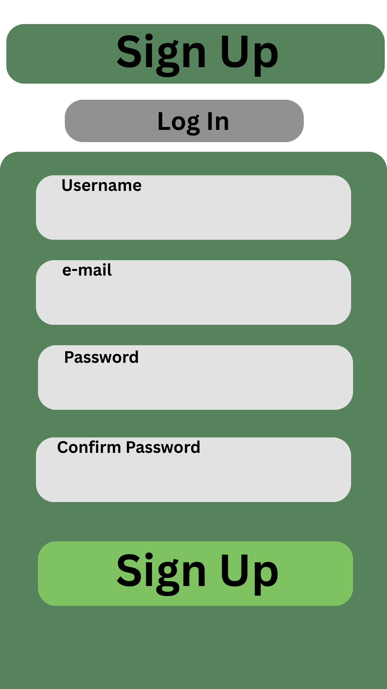

= Sign Up / Log In Design Draft
Author: Dylan Oliver Martinez
Date: February 24, 2026

== Sign Up Logic

=== User Submits

The user provides the following information:

* Name
* Email
* Password
* Confirm Password

=== Backend Validates

The system validates:

* Email format is valid
* Passwords match
* Email is not already registered

== User

=== Parameters

* id
* name
* email

=== Methods

==== Authentication & Account Status

* verifyPassword()
* activate()
* suspend()

==== Registration & Login

* registerUser()
* loginUser()
* logoutUser()

==== Email & Password Management

* verifyEmail()
* requestPasswordReset()
* resetPassword()

==== Operations

* createUser()
* getUserByEmail()
* getUserById()
* updateUser()
* deleteUser()

== Draft

